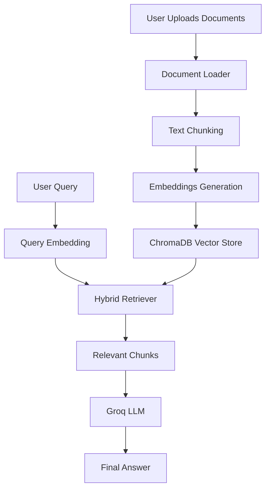
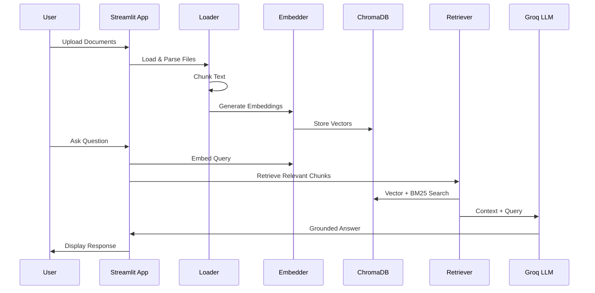

# 📘 RAG Chat Assistant (Groq + ChromaDB)

A **Retrieval-Augmented Generation (RAG)** based document chat application built with **Streamlit**, **Groq LLMs**, and **ChromaDB**. This app allows users to upload documents (PDF, TXT, DOCX), index them efficiently, and ask natural language questions to get accurate, context-aware answers grounded in their own data.

---
## RAG APP working Demo

https://github.com/vikrant8871/Rag-App_Doc-Reader/issues/1#issue-3747620200

## 🚀 Features

* 📂 Upload and process multiple documents
* ✂️ Smart document chunking
* 🔎 Hybrid retrieval (BM25 + Vector Search)
* 🧠 Sentence-Transformers based embeddings
* ⚡ Groq-powered LLM inference (LLaMA models)
* 🗂 Persistent ChromaDB vector store
* 🧾 Source-aware answers
* 🎯 Optimized for enterprise document intelligence (e.g. lease analysis)

---

## 🏗️ Project Architecture

```text
RAG App
│
├── app.py                  # Streamlit UI
├── modules/
│   ├── pipeline.py         # RAG orchestration logic
│   ├── loader.py           # File loading & chunking
│   ├── embedder.py         # Embedding manager
│   ├── retriever.py        # BM25 + vector retrieval
│   ├── llm.py              # Groq LLM wrapper
│   ├── config.py           # Central configuration
│                           # Helpers
│
├── chroma_db/              # Persistent vector store
├── requirements.txt
└── README.md
```

---

## 🔄 How the System Works (High Level)



---

## 🧠 Detailed RAG Pipeline Flow



---

## 📦 Installation

```bash
# Create virtual environment
python -m venv rven

# Activate (Windows)
rven\Scripts\activate

# Activate (Linux/Mac)
source rven/bin/activate

# Install dependencies
pip install -r requirements.txt
```

---

## ⚙️ Configuration

Update `modules/config.py`:

```python
EMBEDDING_MODEL = "sentence-transformers/all-MiniLM-L6-v2"
CHUNK_SIZE = 800
CHUNK_OVERLAP = 100
GROQ_MODEL = "llama-3.1-8b-instant"
```

Set your Groq API key:

```bash
export GROQ_API_KEY=your_api_key_here
```

---

## ▶️ Run the Application

```bash
streamlit run app.py
```

---

## 🎯 Example Use Cases

* Lease agreement intelligence
* Policy & compliance document QA
* Internal knowledge base assistant
* Contract review automation
* Financial and legal document analysis

---

## 🛠️ Tech Stack

* **Frontend**: Streamlit
* **LLM**: Groq (LLaMA 3.1)
* **Embeddings**: Sentence-Transformers
* **Vector DB**: ChromaDB
* **Search**: BM25 + Dense Retrieval
* **Language**: Python 3.10+

---

## 🧩 Key Design Decisions

* **Hybrid Retrieval** improves recall and precision
* **Chunk overlap** prevents context loss
* **Persistent vector store** avoids re-indexing
* **Model-agnostic design** for easy upgrades

---

## 📌 Future Enhancements

* 🔐 User authentication
* 📊 Confidence scoring
* 🧠 Re-ranking with cross-encoders
* 📎 Highlight answers in source docs

---

## 🤝 Contributing

Pull requests are welcome. For major changes, please open an issue first.

## 👨‍💻 Author

**Vikrant Singh**
Data Scientist | AI/ML Engineer
Specialized in RAG Systems, NLP, and Enterprise AI

---

⭐ If this project helped you, consider starring the repository!

